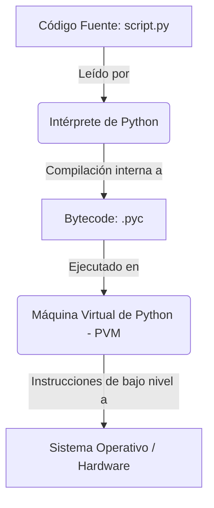

# Módulo 1: Introducción a la Programación y a Python

Este módulo introduce los conceptos fundamentales de la computación, cómo se ejecutan los lenguajes de programación y las características distintivas de Python.

---

## 🎯 Objetivos del Módulo
*   Comprender la diferencia entre lenguaje natural y lenguaje de programación.
*   Conocer el rol y diferencias entre un compilador y un intérprete.
*   Entender la historia, filosofía y ventajas de Python.
*   Conocer cómo se ejecuta un programa básico en Python.

---

## 📋 Qué evalúa el examen (Syllabus Oficial)
*   Conceptos básicos: interpretación, compilación, código fuente, código objeto, máquina virtual.
*   Definición y características de Python: legibilidad, tipado dinámico, orientado a objetos, multiplataforma.
*   El proceso de traducción y ejecución del código.

---

## 📝 Resumen del Módulo
El Módulo 1 sienta las bases conceptuales indispensables. Explica que las computadoras no entienden español o inglés, sino código binario (código máquina). Los lenguajes de programación actúan como puentes, y Python utiliza un modelo interpretado donde un programa llamado "intérprete" traduce y ejecuta el código línea por línea en tiempo de ejecución.

---

## 💡 Conceptos Clave

### A. Lenguaje Natural vs. Programación
*   **Lenguaje Natural:** Humano, ambiguo, redundante, en constante evolución (español, inglés).
*   **Lenguaje de Programación:** Estricto, inequívoco, con reglas sintácticas y semánticas precisas para comunicarse con hardware.

### B. Compilación vs. Interpretación
*   **Compilador:** Traduce todo el código fuente de una vez a código máquina (archivo ejecutable independiente, ej. `.exe`). Es muy rápido en ejecución, pero requiere recompilar ante cualquier cambio (ej. C, C++).
*   **Intérprete:** Traduce y ejecuta el código fuente línea por línea directamente. Es excelente para desarrollo rápido y depuración, pero más lento en ejecución (ej. Python, JavaScript, Ruby).

### C. Características de Python
*   **Interpretado:** No requiere paso de compilación explícito por el programador.
*   **Multiplataforma:** El mismo script corre en Windows, Linux o macOS siempre que esté el intérprete.
*   **Tipado Dinámico:** Las variables no necesitan declaración de tipo previa; su tipo se infiere en la asignación.
*   **Multiparadigma:** Soporta programación estructurada, funcional y orientada a objetos (OOP).

---

## 📊 Diagramas



---

## 💻 Ejemplos de Código

```python
# Un programa clásico de inicio
print("¡Hola, aspirante a PCEP!")

# Demostración de tipado dinámico
variable = 100
print("Tipo inicial:", type(variable))

variable = "Ahora soy un texto"
print("Tipo modificado:", type(variable))
```

---

## ❌ Errores Frecuentes en el Examen
*   **Confundir Bytecode con Código Máquina:** El compilador de Python traduce el código fuente a un formato intermedio llamado **Bytecode** (archivos `.pyc`), no a código máquina nativo. La Máquina Virtual de Python (PVM) es la que convierte ese Bytecode a código máquina en caliente.
*   **Creer que Python es estrictamente compilado o estrictamente interpretado:** Aunque se le categoriza como interpretado, realiza una compilación interna transparente a Bytecode antes de ejecutar.

---

## 🔧 Buenas Prácticas y Trucos
*   **El Zen de Python:** Ejecuta `import this` en una consola interactiva para leer la filosofía de Python (ej. "Beautiful is better than ugly", "Simple is better than complex").
*   **Uso del Flag `-B`:** Al ejecutar Python desde consola (`python -B script.py`), evitas que Python genere la carpeta de caché `__pycache__` con archivos de bytecode `.pyc`, manteniendo tu directorio de trabajo limpio.

---

## ❓ Preguntas de Autoevaluación

### Pregunta 1
¿Qué es el código fuente?
*   A) El archivo binario de bajo nivel que entiende la CPU.
*   B) Un programa escrito en un lenguaje de programación de alto nivel legible por humanos.
*   C) El código de depuración del compilador.
*   D) Un algoritmo escrito en pseudocódigo.
*   *Respuesta Correcta: B*

### Pregunta 2
¿Cuál de las siguientes afirmaciones sobre el intérprete de Python es correcta?
*   A) Traduce todo el código fuente en un solo archivo binario ejecutable y luego finaliza.
*   B) Lee y ejecuta el código línea por línea (o instrucción por instrucción).
*   C) Solo detecta errores de sintaxis después de finalizar toda la ejecución del script.
*   D) No requiere una máquina virtual para funcionar.
*   *Respuesta Correcta: B*

---

## 📝 Mini Examen del Módulo

1.  **¿Quién creó el lenguaje de programación Python?**
    *   *Respuesta:* Guido van Rossum a finales de los años 80.
2.  **¿Qué extensión de archivo tiene el Bytecode compilado de Python?**
    *   *Respuesta:* `.pyc` (habitualmente guardados en la carpeta invisible `__pycache__`).
3.  **¿Qué es la semántica en programación?**
    *   *Respuesta:* Es el significado lógico y el comportamiento esperado del código que es sintácticamente correcto.

---

## 🧪 Laboratorio Práctico

### Tarea
1.  Crea un archivo llamado `hello.py`.
2.  Escribe código que use `print()` para mostrar tu nombre y tu meta de puntaje para el examen PCEP.
3.  Ejecuta el archivo desde tu terminal utilizando `python3 hello.py`.

```python
# Solución sugerida
nombre = "Desarrollador"
puntaje_meta = 290
print(f"Mi nombre es {nombre} y voy a obtener {puntaje_meta}/300 en el PCEP.")
```

---

## 🔍 Ejercicios de Debugging

### Código Incorrecto
El siguiente script pretende imprimir un mensaje de bienvenida, pero tiene un error de sintaxis elemental:
```python
print("Bienvenido al Módulo 1)
```

### Solución
Falta cerrar las comillas dobles de la cadena de texto:
```python
print("Bienvenido al Módulo 1")
```

---

## 📋 Checklist del Módulo
- [ ] Conozco la diferencia entre lenguaje compilado e interpretado.
- [ ] Comprendo qué es el Bytecode y el rol de la PVM.
- [ ] Conozco las principales características de Python.
- [ ] He ejecutado con éxito mi primer script en Python.

---

## 📌 Resumen Rápido
Python es un lenguaje de programación interpretado de alto nivel, con tipado dinámico y multiparadigma, creado por Guido van Rossum. Internamente compila el código fuente `.py` a Bytecode `.pyc` para ser interpretado y ejecutado línea a línea de forma eficiente en la PVM.
